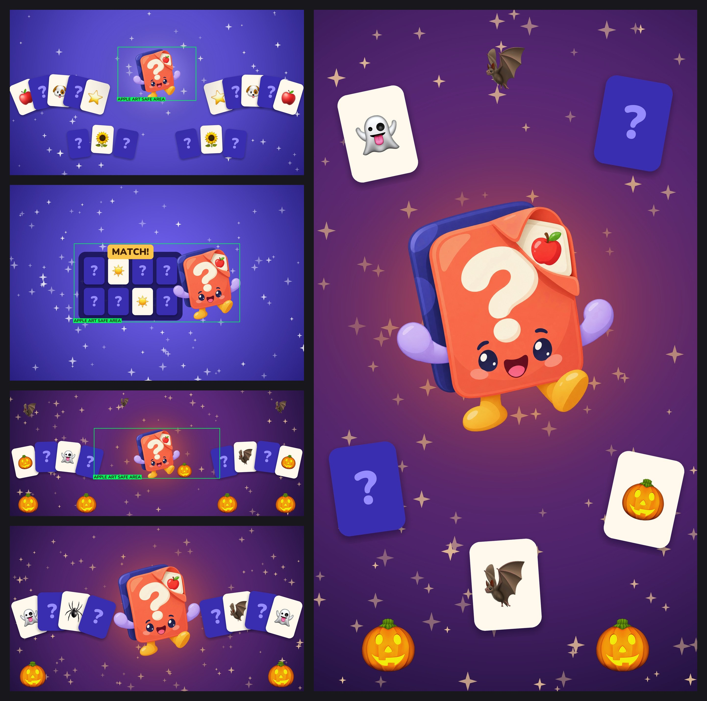
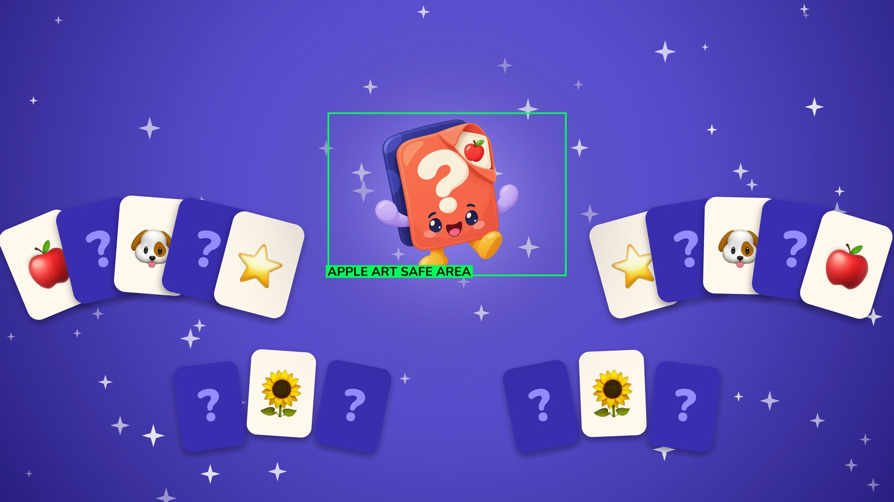
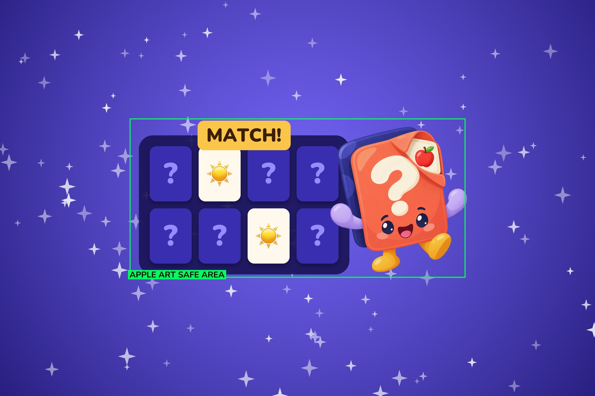
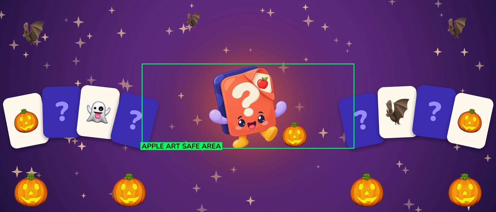
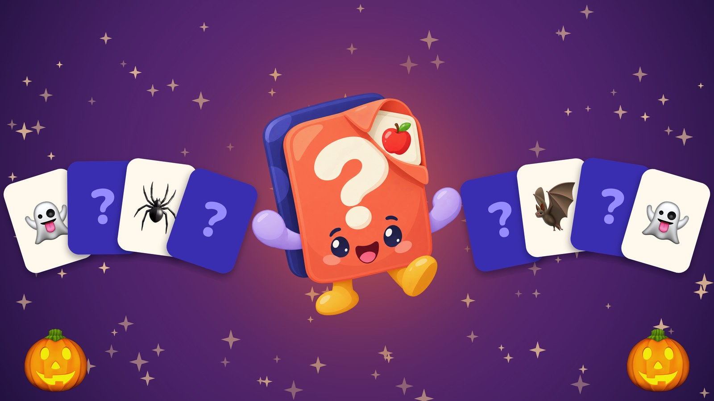
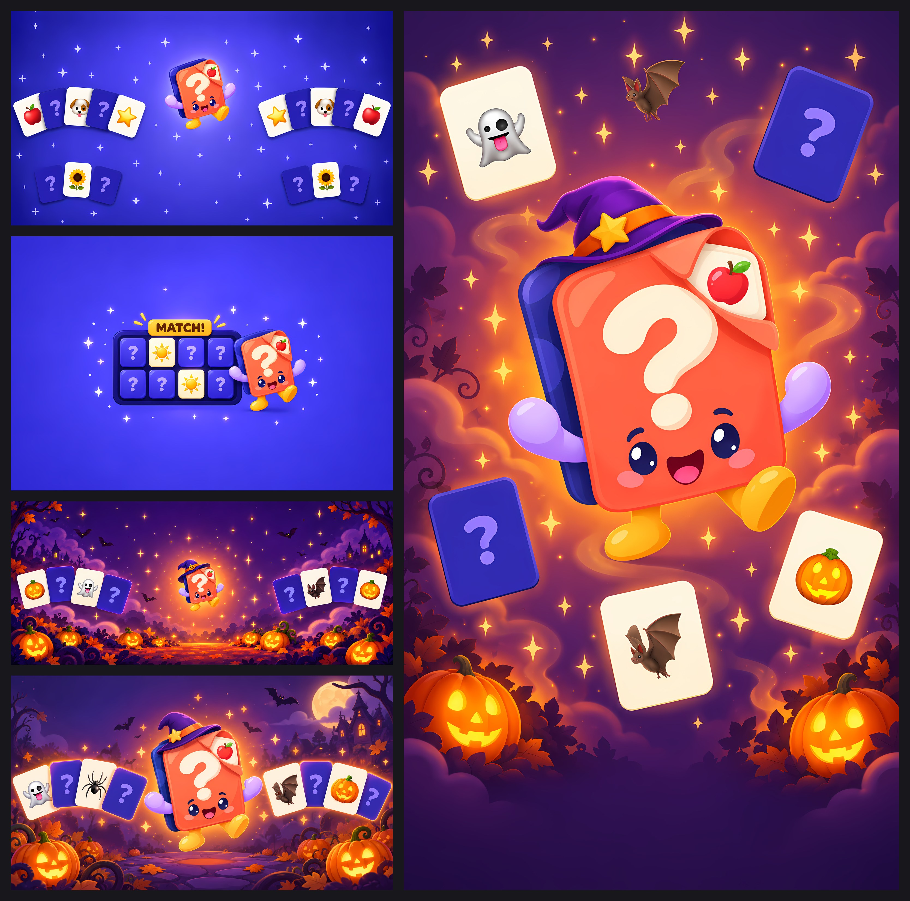
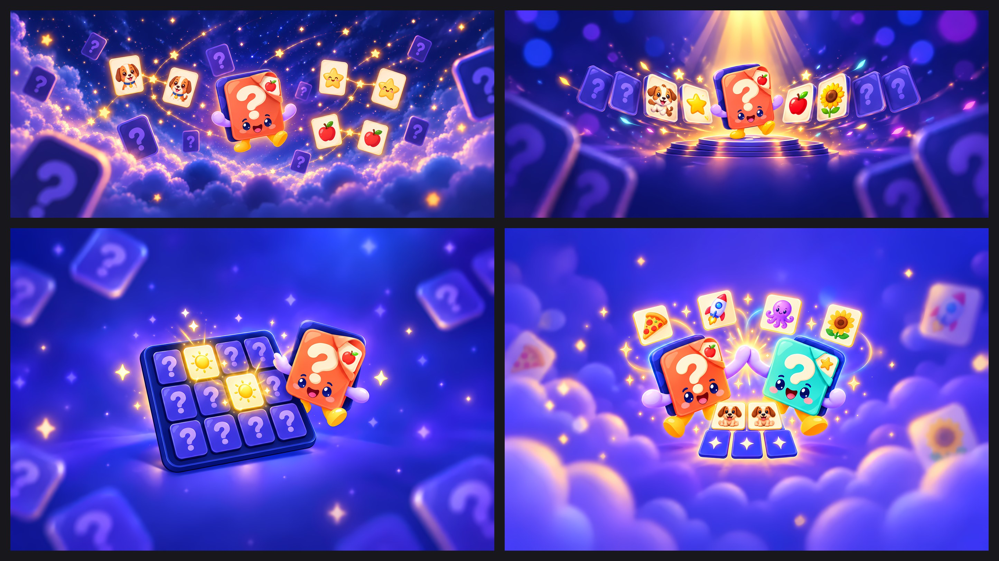

# App Store creative assets — proposal

Apple added three kinds of art to the App Store for iOS 27 and iPadOS 27. DoMemory uses none of them yet:

- **Product page header**: shown above the icon and screenshots.
- **Search results asset**: shown in search in place of the first screenshots.
- **In-app event media**: the event card and event details page.

All of them live in the app's **Asset Library** in App Store Connect, next to the screenshots and app previews. This proposal recommends what to make, when, and how. The images in `blueprints/` are **layout blueprints**, not final art: real Flippo sprites and real emoji placed on Apple's exact canvases. The final illustrations would be generated from them, the same way the Flippo screenshots were made from `../app-store-screenshots-flippo/`.

Researched 2026-10-06, with asc 5.12.1 against DoMemory (app 1533115091) and Apple's own documentation and templates.

## Recommendation

| # | Asset | Canvas | Why | When |
|---|---|---|---|---|
| A | **Universal asset**: one image for both the header and search results | 16:9, 5244 × 2950 PNG | One file covers two placements in every locale. With no text in it, there's nothing to translate. | Evergreen; ship first |
| D | **Spooky Season in-app event**: card plus details page | 16:9 3840 × 2160 and 9:16 2160 × 3840 | The season is already live and its name is already translated into all ten locales. It ends Nov 2, so it's only worth doing now. | Submit by ~Oct 13 |
| C | **Spooky header**: a seasonal swap for A | 21:9, 3840 × 1646 | Puts the season on the product page for its last three weeks, then reverts to A. | Optional, with D |
| B | **Dedicated search asset**: gameplay first | 3:2, 3840 × 2560 | Apple's search guidance is "state the obvious … showcase the firsthand experience". Best run as a product page optimization test against A. | Later |

If time allows only one thing, do **A**. If two, **A + D**.

## What Apple requires

From Apple's [creative assets specifications](https://developer.apple.com/help/app-store-connect/reference/app-information/creative-assets-specifications):

| Placement | Ratio | Pixels | Format |
|---|---|---|---|
| Product page header | 21:9 | 3840 × 1646 | JPEG or PNG |
| Product page header **or** search results (universal) | 16:9 | 5244 × 2950 | **PNG only** |
| Search results | 3:2 | 1920 × 1280 to 3840 × 2560 | JPEG or PNG |
| Event card | 16:9 | 1920 × 1080 to 3840 × 2160 | JPEG or PNG, ≤ 500 MB |
| Event details page | 9:16 | 1080 × 1920 to 2160 × 3840 | JPEG or PNG, ≤ 500 MB |

- **No alpha channel or transparency** in any image.
- **Video is allowed instead**:
  - Header and search results: 5–30 s, 30 or 60 fps, muted, looping.
  - Event media: 15–30 s.
- The existing Flippo gameplay previews are 886 × 1920 portrait, so they can't be reused for any of these.

### Art safe areas

Apple's specs page doesn't give the safe areas. They exist only as the **Art Safe Area** layer in Apple's Photoshop templates, downloaded from [asset best practices](https://developer.apple.com/app-store/asset-best-practices/). Read from those files:

| Canvas | Safe area (x0, y0 – x1, y1) | Size | Share of canvas |
|---|---|---|---|
| Universal 5244 × 2950 | 1921, 660 – 3323, 1622 | 1402 × 962 | 27% × 33%, centred, upper half |
| Header 3840 × 1646 | 1097, 493 – 2743, 1154 | 1646 × 661 | 43% × 40%, centred |
| Search 3840 × 2560 | 836, 765 – 3004, 1795 | 2168 × 1030 | 56% × 40%, centred |

The safe area is small. Everything that carries the idea, meaning Flippo, any stamp, any word, has to sit inside it. Everything else is bleed: it may be cropped on smaller devices or covered by the store's icon, title and Get button. The blueprints' `*-safe-area.jpg` copies draw the box. Apple publishes no safe area for event media, so D keeps its focal point central.

### Content rules

From [asset best practices](https://developer.apple.com/app-store/asset-best-practices/):
- Content must be suitable for a 4+ rating.
- No pricing, discounts, URLs or © symbols.
- No unverifiable claims or awards, and no Apple recognitions such as "App of the Day".
- **No logos or references to other platforms or marketplaces.** The art can't carry a Google Play badge, so the Android listing needs its own variants if it reuses these.
- For the header, Apple's advice is "Focus on a single, clear idea" for a first-time visitor.

### Workflow constraints

- **CLI:** `asc asset-library images upload --library-id 1533115091 --file …` uploads to the library. It **can't submit for review or assign placements**; those are done in the App Store Connect web UI.
- **Standalone review:** creative assets can be reviewed on their own, without a new app version. They're checked against the latest version, and on a live app an approved header can be swapped without a release. That's what makes a seasonal header (C) practical.
- **Role:** submitting needs the Account Holder, Admin, App Manager or Marketing role.

## Concepts

### A — Universal: "Flippo's stage" (header + search)

- **Safe area:** Flippo's win pose fills it, on the screenshots' indigo `#4b3fc9` with a soft glow.
- **Bleed:** face-up matched pairs (🍎 🐶 ⭐️ 🌻) fan out on both sides with face-down cards between them, so the game reads at any crop.
- **No text:** the store already prints the name under the header.
- **Why it works:** it's the first thing a new visitor sees, it matches the icon-plus-screenshots family below it, and it says "card game with a character" without words.
- **For the final illustration:**
  - Same rendering as the screenshot set.
  - Cards with depth and soft shadows.
  - Sparkles kept sparse; the blueprint's are too busy.
  - Flippo fully inside the box, feet included.

### B — Search results: "See the game" (later; optional)

- **Layout:** a 4 × 2 board with one matched pair of ☀️, a gold **MATCH!** stamp, and Flippo cheering beside the board.
- **Fits the safe area:** at 1030 px tall, a third row doesn't fit, so the board is two rows.
- **The stamp is the only word**, and "MATCH!" is already the hero stamp in the live screenshots. Localizing it gives ten files; the alternative is a text-free stamp such as a ✓ burst.
- **How to use it:** as a product page optimization treatment against A, rather than replacing it outright.

### C — Spooky header (optional; Oct 13 – Nov 2)

- **Look:** a night-purple field with the season's accent `#FF6B1A` glowing behind Flippo, and 🎃 👻 🦇 cards in the bleed. The emoji come from the season's own pool in `firebase/scripts/seasons.json`.
- **A Halloween pose for Flippo would help**, for example a small witch hat or holding a jack-o'-lantern. It would come from the same Orca + Codex sprite process as the other poses, with `flippo-idle.png` as the identity reference.
- **Revert on Nov 3:** switch the header back to A.

### D — Spooky Season in-app event

The 9:16 details page is `blueprints/D2-event-details-9x16.jpg`: the same scene, with Flippo large and centred.

- **Text-free.** The event name, the badge and the descriptions are drawn by the App Store. Apple's advice is to complement the badge, not repeat it.
- **Badge:** New Season.
- **Event name:** *Spooky Season*. Every locale's version already exists in `seasons.json` and is under the 30-character limit; the longest is "Temporada de Sustos" and "Stagione da Brivido" at 19.
- **Short description (≤ 50 characters):** the season's subtitle, "30 haunted levels", already translated.
- **Long description (≤ 120 characters):** new copy, which needs the ten-locale pass the release coordinator does for What's New.
- **Dates:** an event can last at most 31 days, so the season's last stretch fits: from approval (~Oct 9–13) to **Nov 2**, the season's `endDate`.
- **Deep link:** there's no season deep link today. Only `domemory://daily` and `domemory://join/CODE` exist. Without one, the event opens the app at the menu, where the season card is the first thing shown. A `domemory://season/spooky-2026` route would be a small optional follow-up for both platforms.

## Production plan

1. **Decide** the open questions below.
2. **Generate finals** from the blueprints using the screenshot pipeline: Codex image generation with the Flippo sprites as identity references. Then fit to the exact canvas with no distortion, keep the focal content inside the measured safe area, and flatten to RGB.
   - A must be **PNG**.
   - C and D can be JPEG at quality ≥ 90.
3. **Validate** each file: exact pixel size, no alpha, sRGB, and the focal content's bounding box inside the safe area. `blueprints.py` already holds the safe-area numbers.
4. **Upload** with `asc asset-library images upload --library-id 1533115091 --file …`.
5. **Submit** in App Store Connect's Asset Library as a **standalone submission**. Then assign:
   - A → product page header + search results, all locales.
   - D → the new in-app event.
   - C → the header from approval until Nov 2.
6. **Store finals** in the repo; see the open questions.

Per `CLAUDE.md`, the catalog's **app-store-artwork-director** owns export and upload. Steps 2–5 are its job once the direction here is approved.

## Open questions

1. **Scope:** A + D now, C and B later? The recommendation is yes.
2. **Halloween pose:** generate a new Flippo pose for C and D, or use the existing win pose?
3. **Where finals live:** `assets/screenshots/` is defined as screenshots shared with Google Play. These assets are App Store–specific placements, so the proposal is a sibling folder, `assets/app-store-creative/<asset>/`, with a `CLAUDE.md` line saying so.
4. **Image or video for A:** a 5–30 s muted loop of cards flipping around Flippo would stand out more. It's a larger production, so it's a fit for a second pass once the still is live.

## Generated finals (2026-10-06)

| Final | Canvas | Source generation | Safe area |
|---|---|---|---|
| `final/A-universal-header-search-5244x2950.png` | 5244 × 2950 PNG | `raw/A-universal-2.png` (third of three), content moved down 3% | Flippo touches the top edge; feet end just inside the bottom |
| `final/B-search-results-3840x2560.png` | 3840 × 2560 PNG | `raw/B-search-2.png` (second of three) | Board, stamp and Flippo all inside |
| `final/C-header-spooky-3840x1646.png` | 3840 × 1646 PNG | `raw/C-header-spooky-4.png` (fourth of five) | Hat tip and feet inside |
| `final/D1-event-card-spooky-3840x2160.jpg` | 3840 × 2160 JPEG q95 | `raw/D1-event-card-1.png` (first) | No Apple safe area; Flippo centred |
| `final/D2-event-details-spooky-2160x3840.jpg` | 2160 × 3840 JPEG q95 | `raw/D2-event-details-1.png` (first) | No Apple safe area; Flippo centred |

**How they were made**
- Generated by a Codex worker under Orca: run `run_9ed55c1664d1`, tasks `task_330cc9c99229`, `task_d7ecf9f00f93` and `task_825810e69ebc`. The task specs are `codex-task.md`, `codex-task-2.md` and `codex-task-3.md`.
- References: the Flippo sprites, the blueprints, and the spooky season card.
- The worker generated only; it never viewed or edited an image.
- Selection and fitting were done by the coordinator:
  - Each selected raw was upscaled 4× with Real-ESRGAN (`realesrgan-x4plus-anime`, ncnn-vulkan 20220424).
  - `finalize.py` then cover-fits it to the exact canvas with Lanczos, applies A's shift, flattens to RGB and asserts the size and mode.

**Why some were redone**
- The first A, B and C generations drew the subject far larger than Apple's safe areas allow.
- Two further rounds with explicit percentage targets brought it inside.
- The generator consistently overshoots the size it's asked for by about 10–15% of the height, so ask for smaller than needed.

**Known flaws to check before upload**
1. **Hat charm mismatch:** Flippo's witch hat has a pumpkin charm in C but a star charm in D1 and D2. It's a minor continuity difference. Either accept it, or regenerate C asking for the star.
2. **B is small at full size:** to fit Apple's safe area, the board group fills only about half the frame. If App Store Connect's preview shows the search card using more than the safe area, a larger variant would read better. `raw/B-search-1.png` is the large version.
3. **Spider card:** D1 includes a realistic black spider emoji. It's 4+-appropriate, but it's the one slightly creepy element.
4. **Preview in App Store Connect:** Asset Library has a product page preview. Check A and C on iPhone and iPad there before submitting; the measured safe areas are Apple's, but the actual crops are only visible there.

## Files

- `final/`: the five upload-ready files plus `contact-sheet.jpg`.
- `raw/`: every unmodified Codex generation, including the rejected variants.
- `blueprints/*.jpg`: 1600-px previews. The `*-safe-area.jpg` copies draw Apple's safe area.
- `blueprints.py`: regenerates the blueprints at full canvas size. It needs Pillow.
- `finalize.py`: the fitting step, run as `python finalize.py <upscaled-dir> A-universal=A-universal-2 …`.
- `codex-task*.md`: the exact specs given to the Codex worker.

## Round 2: dedicated header and search art (2026-10-06)

Higher-quality images built for the dedicated header slot (21:9, 3840 × 1646) and search slot (3:2, 3840 × 2560), meant to replace the universal A in both.

**Quality bar:** real depth, with blurred foreground cards, a crisp subject and an atmospheric background, plus rim light and glow. **No text at all**, so one file serves all ten locales.

| Final | Concept | Source | Safe area |
|---|---|---|---|
| `final/H2-header-constellations-3840x1646.png` | **Recommended header.** Matching pairs joined by golden constellation lines around Flippo, a memory metaphor. | `raw/H2z-header-constellations-1.png` | Flippo inside. Each pair has one card inside the box and its partner just outside. |
| `final/H1-header-stage-3840x1646.png` | Alternative header. Flippo on a spotlit card stage, with cards flipping face-up beside it. | `raw/H1z-header-stage-1.png` | Flippo, all four face-up cards and the stage inside |
| `final/S1-search-match-3840x2560.png` | **Recommended search.** The match moment: two sun cards flip up on a board while Flippo points. Apple's "state the obvious". | `raw/S1z-search-match-2.png` | Board and Flippo inside; the board's lower rim touches the edge |
| `final/S2-search-friends-3840x2560.png` | Alternative search. Flippo and the teal friend high-five over a found pair, with theme cards above. | `raw/S2z-search-friends-1.png` | Characters, high-five and pair inside; theme cards just above; bottom row touches the edge |

**How they were made** (Orca run `run_de1b318f0159`):
1. **First pass** (`codex-task-4.md`): eight generations, two per concept. The quality was right, but every subject was far larger than asked (about 46–80% of the height against 40%).
2. **Zoom-out pass** (`codex-task-5.md`): eight more. Each favourite was passed back as the exact reference with "camera pulled back to about 65%". This kept the scene and fixed the scale, which repeated size instructions never did.
3. **Fallback, not needed:** a local soft-focus extension (shrink plus a blurred self-border) also worked for H2, but the native zoom-out looked better.
4. **Finishing:** Real-ESRGAN 4× upscale, then `finalize.py` (keys `H2-header`, `H1-header`, `S1-search`, `S2-search`).

**Swapping A out:**
- A currently holds the header and search slots on all ten 4.5.0 localizations.
- Replacing it means uploading the chosen pair to the Asset Library and running `asc localizations placements create` with the header and search types per locale.
- Then remove A's placements with `asc localizations placements delete`.
- A stays in the library either way.
